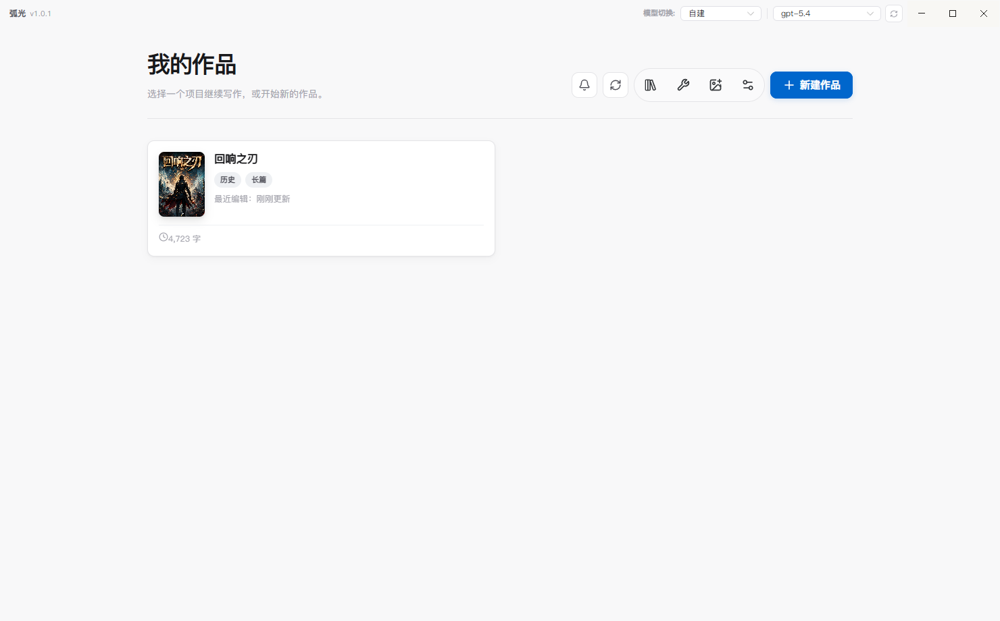
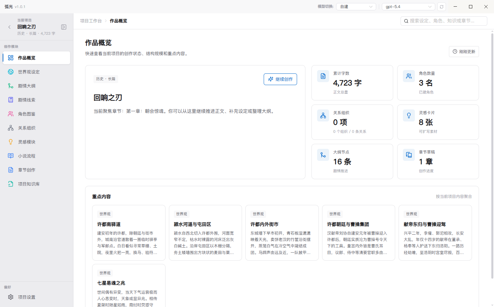
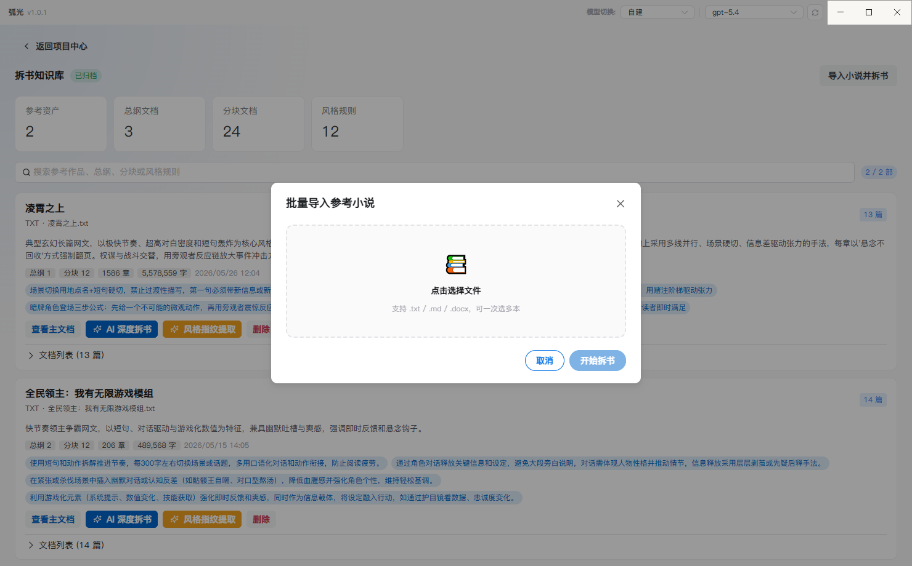
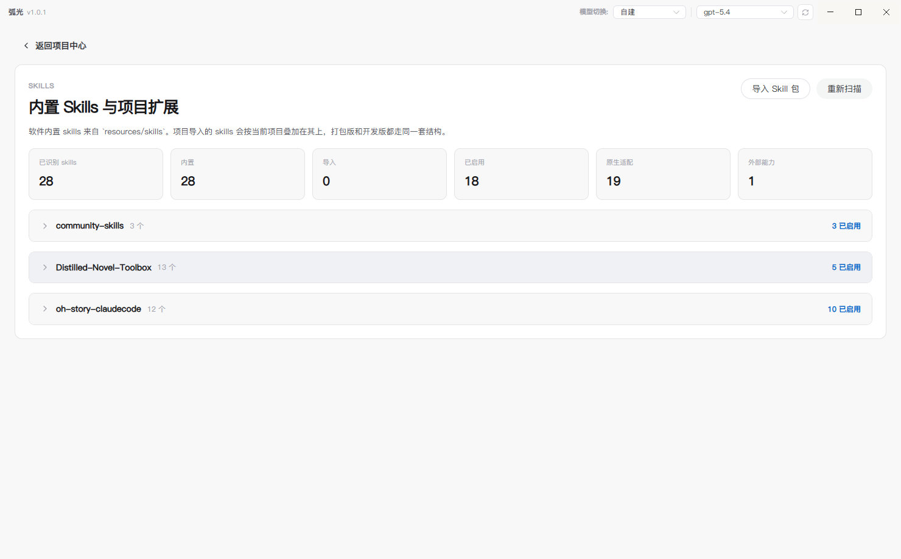
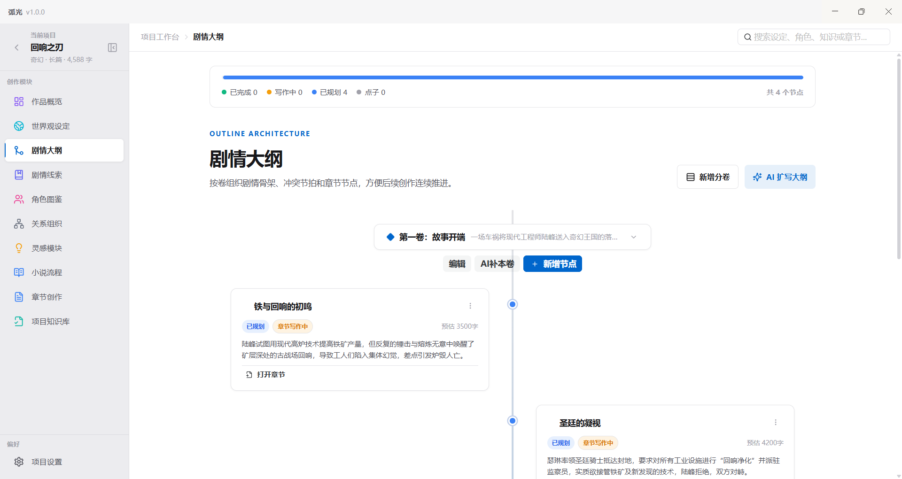
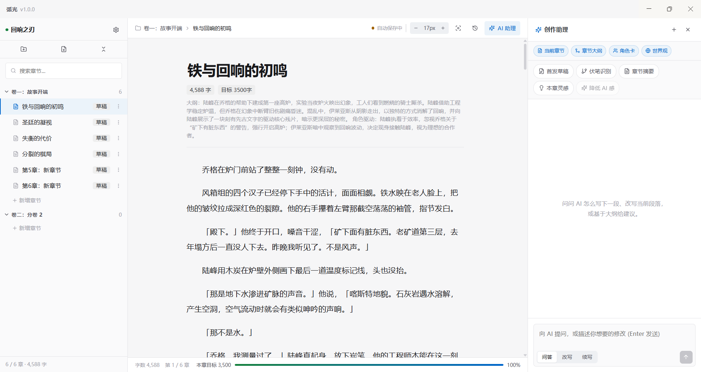
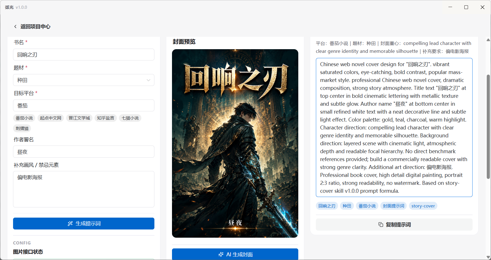

<div align="center">


# CharacterArc

### 弧光 ·  AI 小说创作桌面应用

<p>
  面向需要长期维护项目设定、角色关系、剧情结构与章节正文的创作者
</p>

<p>
  
  
  
  
  
  
</p>

<p>
  <a href="#-功能概览">功能概览</a> ·
  <a href="#-截图">截图</a> ·
  <a href="#-快速开始">快速开始</a> ·
  <a href="#-技术栈">技术栈</a> ·
  <a href="#-内置-skill-包">Skill 包</a> ·
  <a href="#-鸣谢">鸣谢</a>
</p>

</div>

---

## ✨ 项目简介

CharacterArc（弧光）不是"只会对话的 AI 壳子"，而是一套围绕小说项目组织、章节写作与 AI 协作搭起来的桌面工作台。

<table>
  <tr>
    <td width="50%" valign="top">
      <h4>🏠 本地优先</h4>
      <p>项目数据保存在本机 SQLite，无需依赖在线服务，写作内容完全自己掌控。</p>
    </td>
    <td width="50%" valign="top">
      <h4>📦 项目隔离</h4>
      <p>每个项目独立维护设定、章节、知识库与 AI 运行记录，互不干扰。</p>
    </td>
  </tr>
  <tr>
    <td width="50%" valign="top">
      <h4>📖 章节导向</h4>
      <p>大纲、灵感、知识和 AI 能力最终都围绕章节创作落地。</p>
    </td>
    <td width="50%" valign="top">
      <h4>🧩 Skill 驱动</h4>
      <p>AI 调用可按任务自动匹配内置 / 项目级 Skill 包，并支持 Agent Loop 调度。</p>
    </td>
  </tr>
  <tr>
    <td colspan="2" valign="top">
      <h4>🌐 多厂商接入</h4>
      <p>支持所有 OpenAI 兼容接口（DeepSeek、通义千问、智谱、Kimi、SiliconFlow、Ollama 等）和 Anthropic 协议（官方及中转站），只需选协议填地址即可。</p>
    </td>
  </tr>
</table>

## 🚀 功能概览

<details open>
<summary><b>📂 项目与资料</b></summary>

- **项目中心**：创建、查看、编辑、删除小说项目
- **新建项目向导**：填写题材、篇幅、简介，可调用 AI 生成首批设定与大纲
- **小说流程面板**：按分卷维护流程文档，支持参考作品拆解
- **知识中心**：沉淀项目事实、流程文档、参考资料与风格分析结果
- **技能系统**：支持启用内置 Skill，也支持为单项目导入额外 Skill 包

</details>

<details open>
<summary><b>🌍 世界观与结构</b></summary>

- **世界观 / 角色 / 组织 / 关系管理**：维护小说基础设定资产
- **关系图谱**：可视化角色关系与组织关联（Cytoscape）
- **剧情大纲**：双栏交错时间线布局，按分卷组织剧情节点，支持拖拽排序与 AI 扩写
- **剧情线索**：辅助维护伏笔、悬念和回收计划

</details>

<details open>
<summary><b>✍️ 章节创作</b></summary>

- **三栏布局**：目录树 + 正文编辑器 + AI 侧边栏
- **富文本编辑**：基于 TipTap，支持搜索替换、格式化、选区动作
- **自动保存与历史版本**：编辑后自动落盘，支持手动快照与回滚
- **阅读模式 / 专注模式**：以更接近成稿阅读的方式检查节奏
- **字数目标**：按章节设置目标字数并跟踪完成度
- **导出**：章节正文可导出为 `.txt` / `.docx`，工作区可导出 JSON 快照

</details>

<details open>
<summary><b>🤖 AI 辅助</b></summary>

- 章节润色、续写、改写、节奏调整
- 章节摘要生成、伏笔识别、后续剧情链生成
- AI 初稿流式生成、场景规划、章节分析
- 灵感发散包生成、参考作品深度拆解
- **Agent Loop 模式**：让模型按 Skill 索引与工具注册表循环思考
- **任务进度面板**：统一查看正在运行与历史 AI 任务

</details>

<details open>
<summary><b>🎨 封面工作台</b></summary>

- 面向平台（番茄、起点、晋江、知乎盐言、七猫、刺猬猫等）生成封面 Prompt
- 调用图像模型生成预览图，可在工作台中对比历史版本

</details>

## 📸 截图

下面这组截图按实际创作流程排列，基本覆盖了弧光从项目管理、拆书沉淀、Skill 配置到章节写作和封面生成的主要体验。

<table>
  <tr>
    <td width="50%" align="center">
      <a href="docs/assets/homepage.png"></a>
      <br /><sub><b>项目中心</b> · 集中管理所有小说项目</sub>
    </td>
    <td width="50%" align="center">
      <a href="docs/assets/overview.png"></a>
      <br /><sub><b>项目概览</b> · 基础信息、设定资产、章节进度一目了然</sub>
    </td>
  </tr>
  <tr>
    <td width="50%" align="center">
      <a href="docs/assets/book_disassembly.png"></a>
      <br /><sub><b>拆书与知识库</b> · 导入参考作品后沉淀风格分析、知识条目与仿写参考</sub>
    </td>
    <td width="50%" align="center">
      <a href="docs/assets/skills_show.png"></a>
      <br /><sub><b>Skill 系统</b> · 为项目启用内置或扩展 Skill，增强不同写作任务的 AI 输出</sub>
    </td>
  </tr>
  <tr>
    <td width="50%" align="center">
      <a href="docs/assets/story_line.png"></a>
      <br /><sub><b>剧情大纲</b> · 双栏交错时间线，支持拖拽排序与 AI 扩写</sub>
    </td>
    <td width="50%" align="center">
      <a href="docs/assets/chapter_creation.png"></a>
      <br /><sub><b>章节创作</b> · 目录树 + TipTap 编辑器 + AI 侧边栏</sub>
    </td>
  </tr>
  <tr>
    <td colspan="2" align="center">
      <a href="docs/assets/cover_design.png"></a>
      <br /><sub><b>封面工作台</b> · 多平台封面 Prompt 生成与历史版本对比</sub>
    </td>
  </tr>
</table>

## 🧱 技术栈

| 层 | 技术 |
|---|---|
| 框架 | Electron + Vue 3 + TypeScript |
| 状态管理 | Pinia |
| UI 组件库 | Naive UI |
| 构建工具 | electron-vite (Vite 7) |
| 富文本编辑 | TipTap |
| 持久化 | SQLite（主进程） |
| 关系图谱 | Cytoscape |
| AI SDK | Vercel AI SDK (@ai-sdk/openai, @ai-sdk/anthropic) |
| 文档解析 | mammoth (.docx)、marked (Markdown) |

## 📋 环境要求

- **Node.js** 18+
- **pnpm** 10+
- **Windows**（当前脚本默认 Windows 环境）

> 💡 macOS / Linux 开发需将 `package.json` 中的 `set ELECTRON_RUN_AS_NODE=&&` 替换为 `cross-env ELECTRON_RUN_AS_NODE= `，或直接删除该前缀。

## ⚡ 快速开始

```bash
# 安装依赖
pnpm install

# 启动开发环境（同时启动 Electron 主进程 + Vite 渲染进程）
pnpm run dev

# 类型检查 + 构建
pnpm run build

# 打包 Windows 安装程序
pnpm run dist
```

### 🔑 配置 AI

首次进入应用后，在「设置」面板中填写：

<table>
  <tr>
    <td width="50%" valign="top">
      <b>📝 文本生成</b>
      <ul>
        <li>支持维护多套接口配置，并在标题栏快速切换</li>
        <li>协议类型：OpenAI 兼容协议 / Anthropic 协议</li>
        <li>Base URL（只需填域名或路径前缀，系统自动补全 /v1）</li>
        <li>API Key</li>
        <li>模型名称（支持从接口自动拉取）</li>
      </ul>
    </td>
    <td width="50%" valign="top">
      <b>🖼️ 图像生成</b>（封面工作台使用）
      <ul>
        <li>图像模型、API Key、Base URL</li>
      </ul>
    </td>
  </tr>
</table>

## 📁 项目结构

<details>
<summary>点击展开完整目录树</summary>

```
CharacterArc/
├── electron/
│   ├── main/
│   │   ├── ai/                    # AI 管线
│   │   │   ├── agent/             # Agent Loop、系统提示词、工具注册表
│   │   │   ├── prompts/           # 通用提示词片段
│   │   │   ├── runtime/           # 任务调度、上下文构建
│   │   │   ├── skills/            # Skill 加载与匹配
│   │   │   ├── tasks/             # 各 AI 任务 handler
│   │   │   └── transport/         # 模型传输层（OpenAI 兼容 / Anthropic / 图像）
│   │   ├── index.ts               # 主进程入口
│   │   ├── register-main-ipc.ts   # IPC 注册
│   │   ├── window-manager.ts      # 窗口管理
│   │   ├── workspace-store.ts     # SQLite 建表、迁移、快照读写
│   │   └── knowledge-retrieval.ts # 章节调用前的本地知识检索
│   ├── preload/                   # window.characterArc 桥接层
│   └── shared/                    # 主进程/渲染层共享类型
├── renderer/
│   └── src/
│       ├── components/            # 业务组件
│       │   ├── chapterWorkspace/  # 章节创作工作区
│       │   └── home/              # 首页/项目中心
│       ├── features/              # 功能模块（ai、chapters、cover、knowledge、relations...）
│       ├── pages/                 # 页面级视图
│       ├── stores/                # Pinia Store
│       ├── styles/                # 全局样式
│       ├── theme/                 # 主题与设计令牌
│       ├── types/                 # 共享类型
│       └── utils/                 # 工具函数
├── resources/
│   ├── icon.ico / icon.png        # 应用图标
│   └── skills/                    # 内置 Skill 包
├── electron.vite.config.ts
├── package.json
└── tsconfig.json
```

</details>

## 🏛️ 架构概览

```
┌─────────────────────────────────────────────────────────┐
│                    Electron 主进程                        │
│  ┌──────────┐  ┌──────────┐  ┌──────────────────────┐  │
│  │ 窗口管理  │  │  SQLite  │  │     AI 管线          │  │
│  │          │  │ 读写/迁移 │  │ 调度 → Skill → 模型  │  │
│  └──────────┘  └──────────┘  └──────────────────────┘  │
├─────────────────── IPC 桥接 ────────────────────────────┤
│                    Vue 渲染层                            │
│  ┌──────────┐  ┌──────────┐  ┌──────────────────────┐  │
│  │  Pinia   │  │  TipTap  │  │    Naive UI 组件     │  │
│  │  Store   │  │  编辑器  │  │                      │  │
│  └──────────┘  └──────────┘  └──────────────────────┘  │
└─────────────────────────────────────────────────────────┘
```

> **数据流**：启动 → 主进程建窗 → 渲染层初始化 Store → 从 SQLite 加载工作区 → 用户编辑 → Pinia 更新 → 防抖写回 SQLite → AI 请求统一由主进程调用

## 🧰 内置 Skill 包

应用在 `resources/skills/` 下预置了一批可直接启用的 Skill：

<table>
  <thead>
    <tr>
      <th>分类</th>
      <th>Skill</th>
      <th>用途</th>
    </tr>
  </thead>
  <tbody>
    <tr>
      <td rowspan="3"><b>长篇</b></td>
      <td><code>story-long-write</code></td>
      <td>长篇小说写作辅助</td>
    </tr>
    <tr>
      <td><code>story-long-analyze</code></td>
      <td>长篇小说分析</td>
    </tr>
    <tr>
      <td><code>story-long-scan</code></td>
      <td>长篇市场扫描</td>
    </tr>
    <tr>
      <td rowspan="3"><b>短篇</b></td>
      <td><code>story-short-write</code></td>
      <td>短篇小说写作辅助</td>
    </tr>
    <tr>
      <td><code>story-short-analyze</code></td>
      <td>短篇小说分析</td>
    </tr>
    <tr>
      <td><code>story-short-scan</code></td>
      <td>短篇市场扫描</td>
    </tr>
    <tr>
      <td rowspan="2"><b>章节</b></td>
      <td><code>story-chapter-exec</code></td>
      <td>章节执行</td>
    </tr>
    <tr>
      <td><code>story-chapter-repair</code></td>
      <td>章节修复</td>
    </tr>
    <tr>
      <td rowspan="3"><b>风格</b></td>
      <td><code>humanizer-zh</code></td>
      <td>中文去 AI 味润色</td>
    </tr>
    <tr>
      <td><code>style-fingerprint</code></td>
      <td>风格指纹提取</td>
    </tr>
    <tr>
      <td><code>style-fusion</code></td>
      <td>风格融合</td>
    </tr>
    <tr>
      <td rowspan="4"><b>其他</b></td>
      <td><code>story-cover</code></td>
      <td>封面文案与题材拆解</td>
    </tr>
    <tr>
      <td><code>story-deslop</code></td>
      <td>口水话/套路化表达清理</td>
    </tr>
    <tr>
      <td><code>story-blueprint</code></td>
      <td>故事蓝图规划</td>
    </tr>
    <tr>
      <td><code>story-format-tomato</code></td>
      <td>番茄小说排版</td>
    </tr>
  </tbody>
</table>

> 每个项目还可以导入独立的 Skill 包，作用范围仅限该项目。

## 💾 数据存储

应用数据保存在 Electron 用户目录下：

- 📊 **数据库**：`<userData>/data/workspace.db`（SQLite）
- 📦 **项目 Skill**：`<userData>/project-skills/<project-scope>`

> 🔒 所有数据完全本地，不上传任何第三方服务。

## 🙏 鸣谢

- [oh-story-claudecode](https://github.com/worldwonderer/oh-story-claudecode) — 提供了核心写作 Skills 的方法论与 prompt 工程基础
- [dama-cyber/Distilled-Novel-Toolbox](https://github.com/dama-cyber/Distilled-Novel-Toolbox) — 提供了小说工作流与创作辅助方向的参考

## 🔗 友情链接

- [LINUX DO](https://linux.do) — 新的理想型社区

## 📄 License

[MIT](./LICENSE) © zhouyeshan

<div align="center">

<sub>如果这个项目对你有帮助，欢迎 Star ⭐ 支持一下</sub>

</div>
